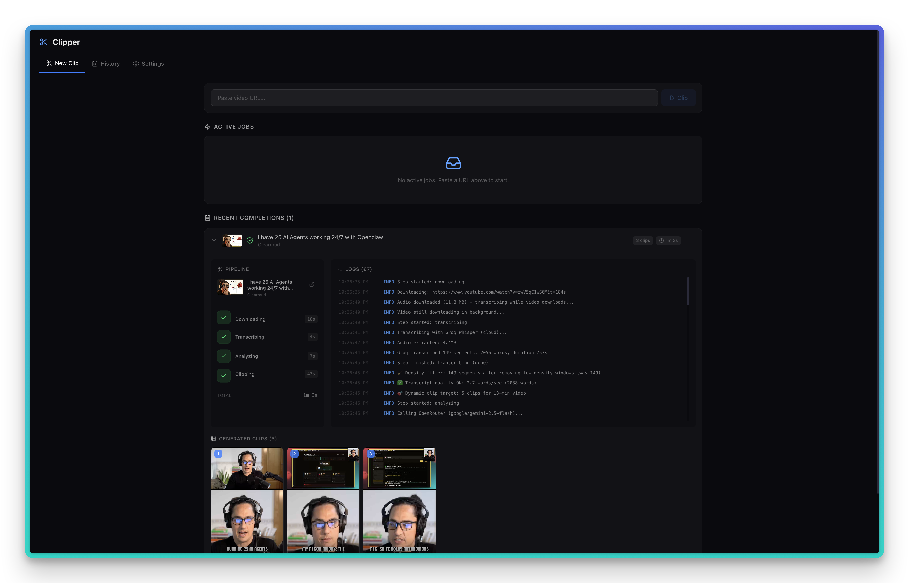

# vid-clipper

**AI-powered video clipper with a visual dashboard.** Paste a video URL, get short-form vertical clips with animated captions — ready to post anywhere.

No cloud account required. Everything runs locally. Works out of the box — no API key needed.

---

## What it does

- Downloads any video (YouTube, and more)
- Transcribes it locally using [faster-whisper](https://github.com/guillaumekynast/faster-whisper) — no API key, runs on your machine
- Uses an LLM (via [OpenRouter](https://openrouter.ai)) to find the best moments worth clipping
- Renders 9:16 vertical clips with animated word-by-word captions
- Visual dashboard to manage jobs, preview clips, and tweak settings

## Dashboard



Paste a URL, hit Clip, and watch the pipeline run in real time. Adjust clip count, duration, AI model, caption style, fonts, and more — all from the UI.

## Quick Start

**Requirements:** Python 3.10+, Node.js 18+, ffmpeg

```bash
# 1. Install ffmpeg
brew install ffmpeg        # macOS
apt install ffmpeg         # Linux

# 2. Clone and set up backend
git clone https://github.com/anl331/vid-clipper.git
cd vid-clipper/backend
pip install -r requirements.txt
cp settings.example.json settings.json
```

Open `settings.json`. No API key needed — it uses a free model by default. Optionally add an [OpenRouter](https://openrouter.ai) key for faster/better paid models:

```json
{
  "openrouter_api_key": ""
}
```

> **Free by default.** Leave `openrouter_api_key` blank and vid-clipper uses `google/gemini-2.0-flash-exp:free` automatically. Add a key to unlock paid models like Gemini Flash or Claude.

```bash
# 3. Start the dashboard
cd ../dashboard
npm install
npm run dev
```

Open `http://localhost:5180` — that's it.

## CLI (no dashboard)

```bash
# Clip a video directly
python3 backend/clipper.py add "https://youtube.com/watch?v=..."

# Check status
python3 backend/clipper.py status
```

## AI Models

Any model on OpenRouter works. Pick based on speed vs quality:

| Model | Speed | Quality | Notes |
|---|---|---|---|
| `google/gemini-2.0-flash-001` | Fast | Great | Default, best all-around |
| `google/gemini-2.5-flash` | Fast | Excellent | Newer, slightly better |
| `anthropic/claude-3.5-sonnet` | Medium | Excellent | Best for nuanced content |
| `openai/gpt-4o` | Medium | Excellent | Solid alternative |

Switch models anytime from the Settings tab — or per-job from the clip form.

## Transcription

By default, transcription runs locally using `faster-whisper` — free, private, no API key needed. It takes ~3 min for a 20-min video on a modern machine.

Want faster transcription? Add a [Groq](https://console.groq.com) API key in Settings. Groq's Whisper API is free and cuts that to ~10 seconds.

## Output

Clips are saved to `backend/clips/<video_id>/`:

```
backend/clips/
  dQw4w9WgXcQ/
    clip_01_The_hook_moment.mp4
    clip_02_Key_insight.mp4
```

## Tech Stack

- **Backend:** Python, yt-dlp, ffmpeg, faster-whisper, OpenRouter
- **Dashboard:** React, Vite, Tailwind CSS
- **Storage:** Local JSON files — no database, no cloud required

## Contributing

PRs welcome. Open an issue first for big changes.

## License

MIT
